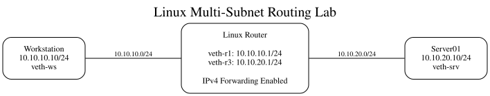

# Linux Multi-Subnet Routing

## Overview

This lab implements a routed network entirely within Linux using network namespaces and virtual Ethernet interfaces.

The environment consists of two separate IPv4 `/24` networks connected by a Linux router. The lab was built manually first to understand the routing process and troubleshoot connectivity, then automated using Bash scripts to provide a reproducible deployment and cleanup process.

Packet analysis with `tcpdump` was used to observe ARP resolution, ICMP traffic, and the Layer 2 changes that occur when an IP packet crosses a router.



## Network Topology

```text
10.10.10.0/24                              10.10.20.0/24

+-------------+       +-------------+       +-------------+
| Workstation |       |    Router   |       |   Server01  |
|             |       |             |       |             |
| 10.10.10.10 |-------| 10.10.10.1 |       | 10.10.20.10 |
|             |       | 10.10.20.1 |-------|             |
+-------------+       +-------------+       +-------------+
    veth-ws        veth-r1     veth-r3          veth-srv
```

## Addressing Scheme

| Namespace | Interface | IPv4 Address | Purpose |
|---|---|---|---|
| workstation | `veth-ws` | `10.10.10.10/24` | Workstation endpoint |
| router | `veth-r1` | `10.10.10.1/24` | Gateway for workstation subnet |
| router | `veth-r3` | `10.10.20.1/24` | Gateway for server subnet |
| server01 | `veth-srv` | `10.10.20.10/24` | Server endpoint |

## Objectives

- Create isolated network environments using Linux network namespaces.
- Connect namespaces using virtual Ethernet (`veth`) pairs.
- Configure IPv4 addressing across multiple subnets.
- Configure default gateways for endpoint networks.
- Use Linux as a Layer 3 router.
- Enable IPv4 packet forwarding.
- Verify end-to-end connectivity between separate subnets.
- Inspect ARP and ICMP traffic using `tcpdump`.
- Understand the relationship between Layer 2 and Layer 3 addressing during routing.
- Troubleshoot routing and return-path failures.
- Automate deployment and teardown of the environment.

## Routing

The workstation and server each have a default route pointing toward the router interface on their local subnet.

### Workstation

```text
default via 10.10.10.1 dev veth-ws
10.10.10.0/24 dev veth-ws proto kernel scope link src 10.10.10.10
```

### Router

```text
10.10.10.0/24 dev veth-r1 proto kernel scope link src 10.10.10.1
10.10.20.0/24 dev veth-r3 proto kernel scope link src 10.10.20.1
```

### Server01

```text
default via 10.10.20.1 dev veth-srv
10.10.20.0/24 dev veth-srv proto kernel scope link src 10.10.20.10
```

The router does not require a default route for this topology because both destination networks are directly connected.

IPv4 forwarding is enabled inside the router namespace to allow packets to move between its two interfaces.

## Packet Analysis

Raw packet captures from both routed network segments are included:

- [`workstation-side-icmp.txt`](captures/workstation-side-icmp.txt)
- [`server-side-icmp.txt`](captures/server-side-icmp.txt)

Comparing the captures demonstrates that the IPv4 source and destination remain consistent across the routed path while the Ethernet source and destination addresses change for each Layer 2 segment.

Traffic was captured on both router interfaces using `tcpdump`.

A key observation was that the source and destination IPv4 addresses remained unchanged as the packet crossed the router:

```text
10.10.10.10 > 10.10.20.10
```

The Ethernet source and destination MAC addresses were different on each network segment.

This demonstrates that the router receives an Ethernet frame on one interface, processes the contained IP packet, makes a Layer 3 forwarding decision, and transmits the packet inside a new Ethernet frame appropriate for the next local segment.

ARP was also observed resolving the MAC address of the required local next hop rather than attempting to resolve the MAC address of a host on a remote subnet.

## Troubleshooting

The lab intentionally progressed through several connectivity failures before achieving successful end-to-end communication.

### Missing Default Route

Initially, the workstation could communicate with its directly connected network but could not reach `10.10.20.10`.

The system returned:

```text
Network is unreachable
```

Inspection of the workstation routing table showed that no route existed for the remote network.

A default route was added:

```bash
ip route add default via 10.10.10.1
```

This allowed remote traffic to be sent to the router.

### IPv4 Forwarding Disabled

Connectivity still failed after configuring the workstation gateway.

Inspection of the router showed:

```text
net.ipv4.ip_forward = 0
```

The router had routes to both networks but was not permitted to forward packets between interfaces.

IPv4 forwarding was enabled:

```bash
sysctl -w net.ipv4.ip_forward=1
```

### Missing Return Route

The server also required a route back toward the workstation network.

A default route was configured through its local router interface:

```bash
ip route add default via 10.10.20.1
```

With routing configured in both directions and IPv4 forwarding enabled, end-to-end ICMP communication succeeded.

## Validation

Connectivity was tested from the workstation namespace to the server:

```bash
ip netns exec workstation ping -c 4 10.10.20.10
```

Successful ICMP echo requests and replies confirmed Layer 3 connectivity between the two subnets.

Additional evidence is stored under `evidence/`, including:

- Interface configuration
- Routing tables
- End-to-end connectivity test

Packet-analysis evidence is stored under `captures/`.

## Automation

The completed topology can be recreated using:

```bash
sudo ./scripts/setup.sh
```

The environment can be removed using:

```bash
sudo ./scripts/cleanup.sh
```

This allows the entire routed environment to be destroyed and rebuilt consistently.

## Key Findings

This lab demonstrated that routing between IPv4 networks requires more than assigning addresses to interfaces.

Endpoint devices require a valid route toward remote networks, routers require knowledge of the destination network and permission to forward packets, and the destination must have a valid return path.

It also demonstrated the separation between Layer 2 and Layer 3 forwarding: IP addressing identifies the end-to-end source and destination, while Ethernet addressing is used for delivery across each individual local network segment.
