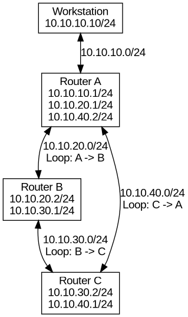

# Linux Routing Loops and TTL

## Overview

This lab demonstrates how IPv4 Time To Live (TTL) prevents packets from circulating indefinitely when a routing loop exists.

A multi-router network was built using Linux network namespaces and virtual Ethernet interfaces. Static routes were deliberately configured so traffic destined for `172.16.50.0/24` enters a routing loop:

`Router A -> Router B -> Router C -> Router A`

Packet captures were used to observe TTL decreasing at each forwarding hop until the packet expired and an ICMP Time Exceeded message was generated.

The lab also involved troubleshooting incorrect subnet prefix lengths and Linux reverse-path filtering.

## Objectives

- Build a multi-router topology using Linux network namespaces.
- Configure IPv4 forwarding.
- Configure static routing.
- Deliberately create a routing loop.
- Observe TTL decrement at each forwarding hop.
- Capture ICMP traffic using tcpdump.
- Observe ICMP Time Exceeded behavior.
- Troubleshoot routing and Linux reverse-path filtering.

## Topology



### Addressing

| Device | Interface | Address |
|---|---|---|
| Workstation | veth-ws | 10.10.10.10/24 |
| Router A | veth-ra1 | 10.10.10.1/24 |
| Router A | veth-ra2 | 10.10.20.1/24 |
| Router A | veth-ra3 | 10.10.40.2/24 |
| Router B | veth-rb1 | 10.10.20.2/24 |
| Router B | veth-rb2 | 10.10.30.1/24 |
| Router C | veth-rc1 | 10.10.30.2/24 |
| Router C | veth-rc2 | 10.10.40.1/24 |

The test destination `172.16.50.10` does not exist. Static routing deliberately causes packets for `172.16.50.0/24` to circulate between the routers.

## Deliberate Routing Loop

The following routes create the loop:

| Router | Destination | Next Hop |
|---|---|---|
| Router A | 172.16.50.0/24 | 10.10.20.2 |
| Router B | 172.16.50.0/24 | 10.10.30.2 |
| Router C | 172.16.50.0/24 | 10.10.40.2 |

This produces:

```text
Router A
   |
   v
Router B
   |
   v
Router C
   |
   v
Router A
